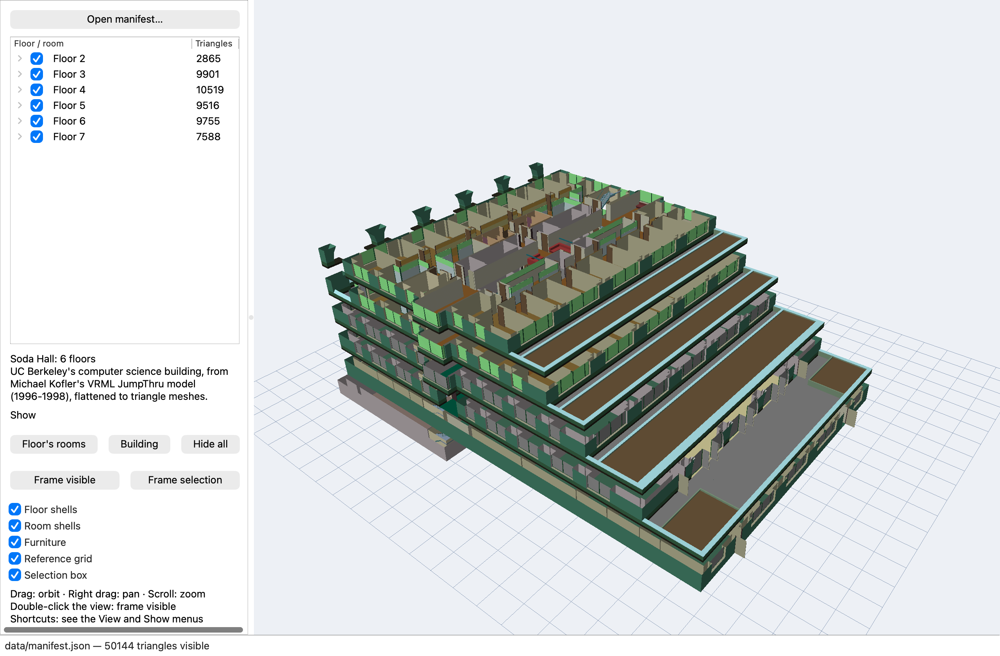
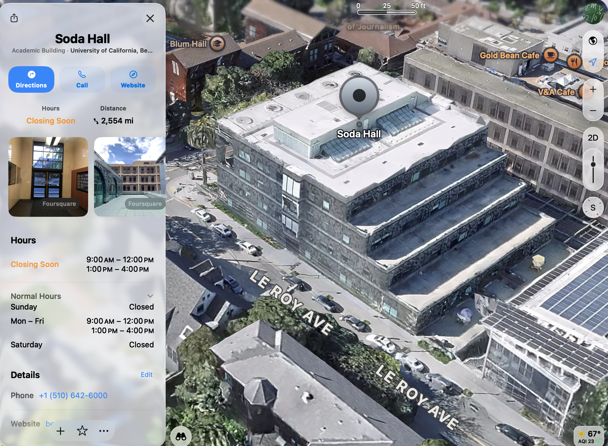
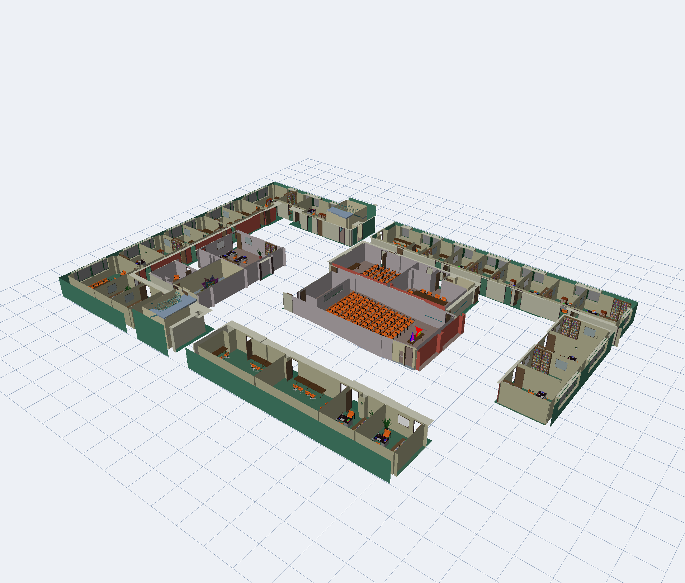

# Soda Hall

A cleaned-up, viewer-ready version of the **Soda Hall VRML JumpThru** model: UC Berkeley's
computer science building, modeled room by room by Michael Kofler in 1996–1998 and published
as VRML 1.0 files at `http.cs.berkeley.edu/~kofler/`. The original files are a scene graph
with a furniture library instanced through DEF/USE and nested transforms, which few modern
tools read. This repository flattens them into plain triangle meshes in one building-wide
coordinate frame, describes them in a manifest, and ships a small Qt 6 viewer.



*Every floor's walls. Floors step back as they rise; the lower left block is floor 2.*



*The real building in Apple Maps, from a similar direction. The three terraced setbacks on
the Le Roy Avenue side are the steps between floors 4 and 5, 5 and 6, and 6 and 7 in the
model, whose long axis shrinks from about 188 to 122 feet over those floors while the
short axis stays near 130 feet. The model stops at the walls of floors 2 through 7 and has
no roof, mechanical penthouse, or below-grade levels.*



*Floor 3 with all 36 rooms shown: the lecture hall with its rows of chairs is in the middle.*

## The dataset

`tools/build_dataset.py` reads the mirrored site and writes `data/`:

| Path | Contents |
| --- | --- |
| `data/manifest.json` | Every floor and room: ids, names, mesh paths, bounds, triangle counts, furniture placements |
| `data/floors/floor-N.shell.off` | Walls, floors, and doors of a whole floor, without furniture (Kofler's per-floor files) |
| `data/floors/floor-N.furniture.off` | The furniture of every room on floor N, merged |
| `data/rooms/floor-N/room-XXX.shell.off` | One room's walls, floor, ceiling openings, doors, and windows |
| `data/rooms/floor-N/room-XXX.furniture.off` | That room's furniture and sculptures |
| `data/floorplans/floor-N.gif` | The site's floor plan bitmaps |
| `data/source/` | The original `.wrl.gz` files and index pages, untouched |

Meshes are ASCII OFF files: triangles only, with an `r g b` color in 0..1 after each face,
and coordinates in the building's own frame (inches, Z up; the building spans about
2400 × 2100 × 930 inches). Any floor or room file can be loaded next to any other without a
transform. Room ids follow the building's numbering: `room-319` is room 319, `room-283a` a
lettered sub-room, and `stairs-3-1` the first stairwell drawn on floor 3. Six floors
(2 through 7), 177 rooms, 1.46 million triangles in total, 144 MB.

A room's *shell* is the geometry written directly into its file; its *furniture* is
everything reached through a `USE` of a named object (CHAIR1, BOOKSHELF2, POTTED_PLANT,
and so on), which the manifest also counts per room under `objects`. Fourteen rooms contain
Carlo Séquin's mathematical sculptures (TETRATANGLE, MINTORI, CUBOGEAR, and others).

To regenerate the dataset from a mirror of the site:

```sh
python3 tools/build_dataset.py /path/to/mirror/%7Ekofler data
```

The mirror directory must contain `floors-standard/` and `rooms-standard/`. Conversion takes
under a minute and needs only the Python standard library. `tools/vrml1.py` is the VRML 1.0
reader and can convert a single file:

```sh
python3 tools/vrml1.py data/source/rooms-standard/floor3/room319.wrl.gz out/room319
```

## Quick start

Requires CMake 3.24+, a C++20 compiler, and GLM with its CMake package installed. Set
`CMAKE_PREFIX_PATH` if CMake cannot find GLM or Qt.

Headless build, tests, and a dataset check:

```sh
cmake -S . -B build -DCMAKE_BUILD_TYPE=Release
cmake --build build
ctest --test-dir build --output-on-failure
./build/native/soda_inspect data/manifest.json --verify --rooms
```

Viewer build (needs Qt 6 Base with Widgets, OpenGL, and OpenGLWidgets):

```sh
cmake -S . -B build-gui -DCMAKE_BUILD_TYPE=Release -DSODA_BUILD_GUI=ON
cmake --build build-gui -j 4
./build-gui/native/soda_viewer data/manifest.json
```

The renderer is OpenGL 3.3 core through QOpenGLWidget, tested on Apple Silicon with
Qt 6.11.

## Using the viewer

The left panel lists floors and rooms with checkboxes; the right side is the 3D view.
Checking a floor shows its walls. Checking a room shows its walls and furniture. Meshes are
read the first time they are shown and stay loaded afterwards. The status bar counts the
triangles on screen. Selecting a row outlines it in orange and describes it; double-clicking
a row frames it.

| Control | Effect |
| --- | --- |
| **Floor's rooms** | Show every room of the selected floor |
| **Building** | Show every floor's walls and hide the rooms |
| **Hide all** | Uncheck everything |
| **Frame visible** / **Frame selection** | Fit the camera to what is shown or to the selected row |
| Floor shells, Room shells, Furniture | Filter what is drawn by kind without unchecking rows |
| Reference grid, Selection box | Overlays |

| Mouse | Effect |
| --- | --- |
| Left drag | Orbit around the target |
| Right or middle drag | Pan |
| Scroll wheel | Zoom |
| Double-click the view | Frame the visible parts |

Command line: `soda_viewer [MANIFEST.json] [--show=IDS] [--capture OUTPUT.png]`.
`--show` takes a comma-separated list such as `floor-3,room-319` or `floor-3/rooms` for a
whole floor; without it every floor's walls are shown. `--capture` saves the window and
the framebuffer after the first paint and exits, for unattended checks:

```sh
./build-gui/native/soda_viewer data/manifest.json --show=floor-3/rooms --capture floor3.png
```

## Layout

- `tools/vrml1.py`: VRML 1.0 subset reader; flattens a file into shell and furniture meshes.
- `tools/build_dataset.py`: runs the reader over the mirror and writes `data/`.
- `native/mesh/`: Qt-free library with the OFF reader, a minimal JSON reader, and the
  manifest model with a verification pass.
- `native/tools/inspect.cpp`: headless inspector, also used as the dataset consistency test.
- `native/viewer/`: the Qt 6 viewer (window, viewport, capture mode, entry point).
- `native/tests/`: OFF and manifest tests, run through CTest.

Code style follows the repository's `.clang-format`; run it over `native/` before finishing
a change.

## Credits

The model is Michael Kofler's, produced with the `ug2vrml` exporter from Carlo Séquin's
Berkeley UniGrafix building database. The original site links a report,
`vrmljumpthru.ps`, that this mirror does not include. Everything under `data/source/` is his
work, copied unchanged; the conversion tools and the viewer are new.
