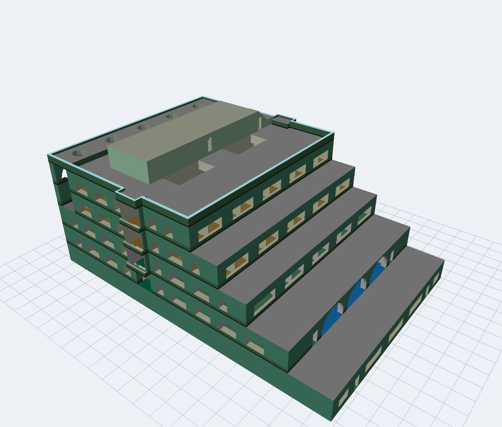
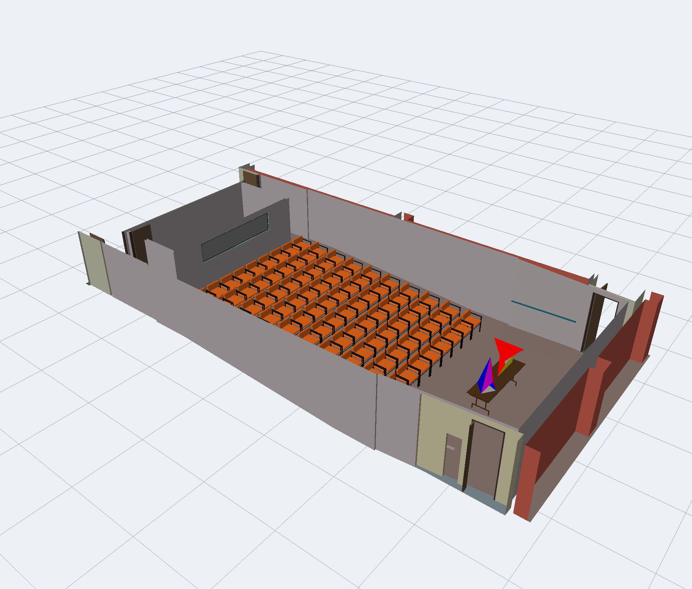
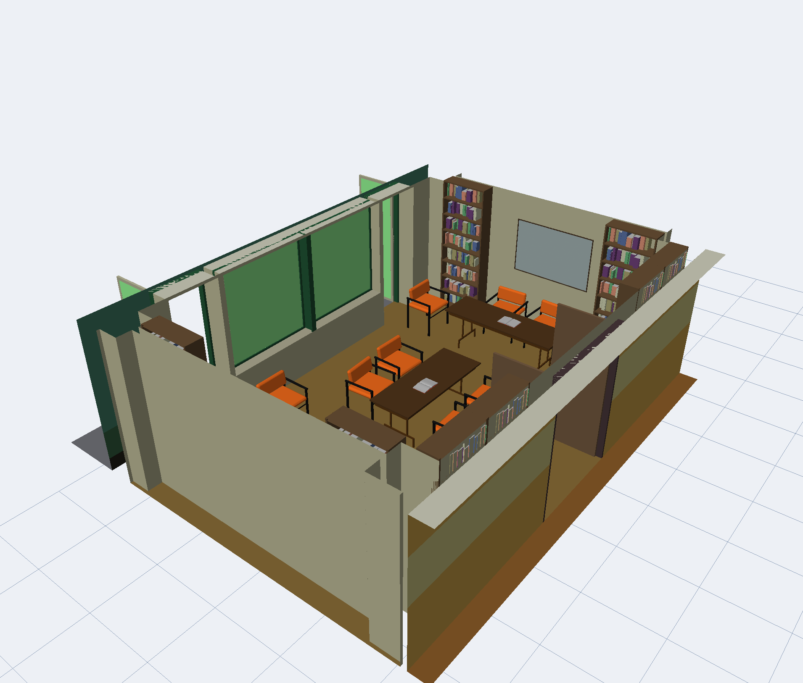

# Soda Hall

A cleaned-up, viewer-ready version of the **Soda Hall VRML JumpThru** model: UC Berkeley's
computer science building, modeled room by room by Michael Kofler in 1996–1998 and published
as VRML 1.0 files at `http.cs.berkeley.edu/~kofler/`. The original files are a scene graph
with a furniture library instanced through DEF/USE and nested transforms, which few modern
tools read. This repository flattens them into plain triangle meshes in one building-wide
coordinate frame, describes them in a manifest, and ships a small Qt 6 viewer.


*Every floor's walls. Floors step back as they rise; the lower left block is floor 2.*


*The real building in Apple Maps, from a similar direction. The three terraced setbacks on
the Le Roy Avenue side are the steps between floors 4 and 5, 5 and 6, and 6 and 7 in the
model, whose long axis shrinks from about 188 to 122 feet over those floors while the
short axis stays near 130 feet. The model stops at the walls of floors 2 through 7 and has
no roof, mechanical penthouse, or below-grade levels.*


*Floor 3 with all 36 rooms shown: the lecture hall with its rows of chairs is in the middle.*

## The dataset

`tools/build_dataset.py` reads the mirrored site and writes `data/`:

| Path | Contents |
| --- | --- |
| `data/manifest.json` | Every floor and room: ids, names, mesh paths, bounds, triangle counts, furniture placements |
| `data/floors/floor-N.shell.off` | Walls, floors, and doors of a whole floor, without furniture (Kofler's per-floor files) |
| `data/floors/floor-N.furniture.off` | The furniture of every room on floor N, merged |
| `data/rooms/floor-N/room-XXX.shell.off` | One room's walls, floor, ceiling openings, doors, and windows |
| `data/rooms/floor-N/room-XXX.furniture.off` | That room's furniture and sculptures |
| `data/floorplans/floor-N.gif` | The site's floor plan bitmaps |
| `data/walkthru/building.shell.off`, `floor-5.shell.off` | The 1994 WALKTHRU UniGrafix models, converted (see below) |
| `data/source/` | The original `.wrl.gz` files and index pages, untouched, plus `walkthru/` with the UniGrafix files |

Meshes are ASCII OFF files: triangles only, with an `r g b` color in 0..1 after each face,
and coordinates in the building's own frame (inches, Z up; the building spans about
2400 × 2100 × 930 inches). Any floor or room file can be loaded next to any other without a
transform. Room ids follow the building's numbering: `room-319` is room 319, `room-283a` a
lettered sub-room, and `stairs-3-1` the first stairwell drawn on floor 3. Six floors
(2 through 7), 177 rooms, 1.46 million triangles in total, 144 MB.

A room's *shell* is the geometry written directly into its file; its *furniture* is
everything reached through a `USE` of a named object (CHAIR1, BOOKSHELF2, POTTED_PLANT,
and so on), which the manifest also counts per room under `objects`. Fourteen rooms contain
Carlo Séquin's mathematical sculptures (TETRATANGLE, MINTORI, CUBOGEAR, and others).

To regenerate the dataset from a mirror of the site:

```sh
python3 tools/build_dataset.py /path/to/mirror/%7Ekofler data
```

The mirror directory must contain `floors-standard/` and `rooms-standard/`. Conversion takes
under a minute and needs only the Python standard library. `tools/vrml1.py` is the VRML 1.0
reader and can convert a single file:

```sh
python3 tools/vrml1.py data/source/rooms-standard/floor3/room319.wrl.gz out/room319
```

## Quick start

Requires CMake 3.24+, a C++20 compiler, and GLM with its CMake package installed. Set
`CMAKE_PREFIX_PATH` if CMake cannot find GLM or Qt.

Headless build, tests, and a dataset check:

```sh
cmake -S . -B build -DCMAKE_BUILD_TYPE=Release
cmake --build build
ctest --test-dir build --output-on-failure
./build/native/soda_inspect data/manifest.json --verify --rooms
```

Viewer build (needs Qt 6 Base with Widgets, OpenGL, and OpenGLWidgets):

```sh
cmake -S . -B build-gui -DCMAKE_BUILD_TYPE=Release -DSODA_BUILD_GUI=ON
cmake --build build-gui -j 4
./build-gui/native/soda_viewer data/manifest.json
```

The renderer is OpenGL 3.3 core through QOpenGLWidget, tested on Apple Silicon with
Qt 6.11.

## Using the viewer

The left panel lists floors and rooms with checkboxes; the right side is the 3D view.
Checking a floor shows its walls. Checking a room shows its walls and furniture. Meshes are
read the first time they are shown and stay loaded afterwards. The status bar counts the
triangles on screen. Selecting a row outlines it in orange and describes it; double-clicking
a row frames it.

| Control | Effect |
| --- | --- |
| **Floor's rooms** | Show every room of the selected floor |
| **Building** | Show every floor's walls and hide the rooms |
| **Hide all** | Uncheck everything |
| **Frame visible** / **Frame selection** | Fit the camera to what is shown or to the selected row |
| Floor shells, Room shells, Furniture | Filter what is drawn by kind without unchecking rows |
| Reference grid, Selection box | Overlays |

| Mouse | Effect |
| --- | --- |
| Left drag | Orbit around the target |
| Right or middle drag | Pan |
| Scroll wheel | Zoom |
| Double-click the view | Frame the visible parts |

Command line: `soda_viewer [MANIFEST.json] [--show=IDS] [--capture OUTPUT.png]`.
`--show` takes a comma-separated list of ids such as `floor-3`, `room-319`, or
`walkthru-building`, plus three shortcuts: `floor-3/rooms` for every room on a floor,
`rooms` for every room in the building with its furniture, and `building` for every floor's
walls, which is what you get without the flag. Furniture belongs to rooms, so it appears
whenever a room is shown. `--capture` saves the window and the framebuffer after the first
paint and exits, for unattended checks:

```sh
./build-gui/native/soda_viewer data/manifest.json --show=rooms
./build-gui/native/soda_viewer data/manifest.json --show=floor-3/rooms --capture floor3.png
```

`--benchmark[=REPEATS]` measures how fast the GPU draws whatever is shown: with vertical sync
off, each paint draws the visible parts REPEATS times (default 20) and waits for the GPU, and
after about five seconds the viewer prints triangles per second and the time for one full
scene, then exits. On an Apple M5 with a 10-core GPU, every room with furniture (1.41 million
triangles, 180 draw calls) draws in about 1.4 ms, roughly 980 million triangles per second;
the six floor shells alone, whose large slabs cover the viewport many times over, are
fill-bound at about 260 million per second.

```sh
./build-gui/native/soda_viewer data/manifest.json --show=rooms --benchmark
```

## Layout

- `tools/vrml1.py`: VRML 1.0 subset reader; flattens a file into shell and furniture meshes.
- `tools/build_dataset.py`: runs the reader over the mirror and writes `data/`.
- `native/mesh/`: Qt-free library with the OFF reader, a minimal JSON reader, and the
  manifest model with a verification pass.
- `native/tools/inspect.cpp`: headless inspector, also used as the dataset consistency test.
- `native/viewer/`: the Qt 6 viewer (window, viewport, capture mode, entry point).
- `native/tests/`: OFF and manifest tests, run through CTest.

Code style follows the repository's `.clang-format`; run it over `native/` before finishing
a change.

## Provenance and status

The model is Michael Kofler's, produced with the `ug2vrml` exporter from the UniGrafix
building database that Carlo Séquin's group at Berkeley built for the UC WalkThru project.
Kofler published it as the "SodaHall VRML JumpThru" at `http://www.cs.berkeley.edu/~kofler/`
(also served as `http.cs.berkeley.edu`), last updated May 20, 1998. The room files carry
April 1998 timestamps and the floor plans December 1996.

**The original site is gone.** As of September 2026 the address redirects to
`people.eecs.berkeley.edu/~kofler/`, which returns 404. The Wayback Machine holds the main
page ([August 2000 snapshot](http://web.archive.org/web/20000820115434/http://www.cs.berkeley.edu:80/~kofler/))
and the accompanying report, `vrmljumpthru.ps`
([September 2000 snapshot](http://web.archive.org/web/20000917030157/http://www.cs.berkeley.edu:80/~kofler/vrmljumpthru.ps)),
but not the room and floor files themselves. The copy under `data/source/` was mirrored with
wget in April 2001 and is, as far as we know, the only surviving copy of the VRML files. It
is the "standard" version of the site: one gzip-compressed VRML 1.0 file per room with
furniture inlined, plus one file per floor without furniture. The site also offered an
"inline" version with furniture in separate files, and mentioned furniture-and-texture
versions that were never linked; none of those were mirrored.

Related material still online:

- [Carlo Séquin's Soda Hall page](https://people.eecs.berkeley.edu/~sequin/soda/soda.html)
  still links to Kofler's site from its pictures section.
- [Seth Teller's geometric datasets page](https://people.csail.mit.edu/teller/datasets/datasets.html)
  at MIT hosts the UniGrafix source models the VRML was exported from: the fifth floor
  (`csb5.macro.ug`) and the whole building (`csb3r.macro.ug`).

**The WALKTHRU model.** Those two UniGrafix files are the "U.C. Berkeley Soda Hall
WALKTHRU Model", version 1.0 of December 1994, built by the UC Berkeley Walkthrough Group
(Thurman Brown, Rick Bukowski, Laura Downs, Tom Funkhouser, Delnaz Khorramabadi, Carlo
Séquin, MaryAnn Simmons, and Seth Teller) with Celeste Fowler and Pat Hanrahan of Princeton.
Copies downloaded from Teller's page on September 14, 2026 are kept under
`data/source/walkthru/` with their SHA-256 sums, and `tools/unigrafix.py` converts them to
`data/walkthru/`. They are walls only, floors 3 through 7 with roof structures in the whole
building file, and they sit in the same coordinate frame as the VRML rooms, so the viewer
lists them as two extra rows that can be shown next to Kofler's floors. Their permission
notice, which must stay attached, allows use, copying, and modification, and forbids
redistribution for payment or commercial exploitation. Please cite the model by that name.



*The WALKTHRU whole-building model: a closed exterior with roof, terraces, and window
openings, unlike Kofler's open-topped floor shells.*

**The model in the literature.** This is the building model behind the Berkeley
walkthrough papers of the early 1990s. Funkhouser and Séquin's
[*Adaptive Display Algorithm for Interactive Frame Rates During Visualization of Complex
Virtual Environments*](https://www.cs.princeton.edu/~funk/sig93.pdf) (SIGGRAPH 93) names
"a model of Soda Hall, the future Computer Science Building at UC Berkeley" as its test case,
and two of its rooms are identifiable here: Figure 10's lecture hall with its tiers of chairs
is room 306a, which in this dataset has 90 chairs and one of Séquin's sculptures on the front
table, and Figure 11's "small library on the sixth floor" is room 681, with the same orange
armchairs, wood tables, open books, and bookshelves. The paper's own images were rendered
from the 1994-era UniGrafix data with textures; the furniture in Kofler's 1998 export is a
later re-modeling of the same rooms. The same building model appears in Teller and Séquin's
*Visibility Preprocessing for Interactive Walkthroughs* (SIGGRAPH 91), Funkhouser, Séquin,
and Teller's *Management of Large Amounts of Data in Interactive Building Walkthroughs*
(Symposium on Interactive 3D Graphics, 1992), and Teller's and Funkhouser's Berkeley
dissertations (1992 and 1993).



*Room 306a: the lecture hall of the SIGGRAPH 93 paper's Figure 10.*



*Room 681: the sixth-floor library of the paper's Figure 11.*

**Availability.** The VRML files were published openly on a university web page without a
stated license, and their author could not be reached. They are redistributed here unchanged
and with credit, as a historical dataset of a well-known building model from the 1990s
architectural walkthrough literature. If you hold rights to the model and object, open an
issue and the files will be removed. The conversion tools, the library, the viewer, and this
documentation are new work under the [MIT License](LICENSE); the license does not extend to
the model files or the meshes derived from them.

The converted meshes and manifest are attached to each
[release](https://github.com/ctsilva/soda-hall/releases) as `soda-hall-meshes-<version>.tar.gz`;
unpack it into `data/` to use the viewer without running the converter.
